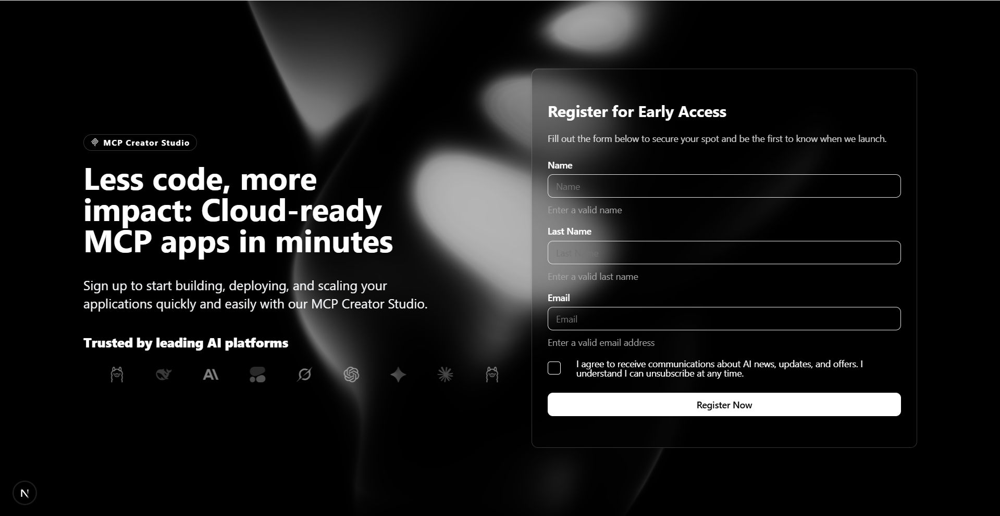

# MCP CREATOR STUDIO

MCP Creator Studio is a web application designed to facilitate the creation and management of MCP Model Context Protocols. Built with modern web technologies, it offers a user-friendly interface for users to register, log in, and manage their MCP models efficiently.

## Page Register

The registration page allows new users to create an account by providing their email, password, and agreeing to the terms of service. The form includes validation to ensure that all required fields are filled out correctly.



## Technologies Used

- **Next.js**: A React framework for building server-side rendered and statically generated web applications.
- **TypeScript**: A superset of JavaScript that adds static typing to the language
- **Tailwind CSS**: A utility-first CSS framework for rapid UI development.
- **React Hook Form**: A library for managing form state and validation in React applications.
- **Zod**: A TypeScript-first schema declaration and validation library.
- **Prisma**: An ORM (Object-Relational Mapping) tool for database management
- **Biomes**: A tool for code formatting and linting.

## Getting Started

To run the MCP Creator Studio locally, follow these steps:

1. Clone the repository:

   ```bash
   git clone https://github.com/Kevinhc23/mcp-creator-studio
   ```

2. Navigate to the project directory:

   ```bash
   cd mcp-creator-studio
   ```

3. Install the dependencies:

   ```bash
    pnpm install
   ```

4. Set up the environment variables by creating a `.env` file in the root directory and adding the necessary configurations.
5. Run the development server:

   ```bash
   pnpm run dev
   ```

6. Open your browser and navigate to `http://localhost:3000` to view the application.

## Contributing

Contributions are welcome! If you find a bug or want to add a new feature, please open an issue or submit a pull request.

## License

This project is licensed under the MIT License. See the [LICENSE](./LICENSE) file for
details.
more information.

## Acknowledgments

- Thanks to the open-source community for the tools and libraries that made this project possible.
- Inspired by modern web development practices and user-centric design.

## Contact

For any questions or inquiries, please contact: [Kevin Hernandez](mailto:kevinhernandezcrespo97@gmail.com)
